Travis Scott Burger Fantasy League 2026
================

*All data from
<a href="https://ffscrapr.ffverse.com/" target="_blank">ffscrapr</a> R
library*

------------------------------------------------------------------------

### Contents

- [Team Standings](#team-standings)
- [Points Scored per Game](#points-scored-per-game)
- [Points Against per Game](#points-against-per-game)
- [Points Scored and Against](#points-scored-and-against)
- [Optimal Lineup Setting](#optimal-lineup-setting)
- [Season Long Optimal Lineups](#season-long-optimal-lineups)
- [Most Points Scored in a Loss](#most-points-scored-in-a-loss)
- [Fewest Points Scored in a
  Victory](#fewest-points-scored-in-a-victory)
- [Weekly Scoring Trends](#weekly-scoring-trends)
- [Close Games](#close-games)
- [Highest Scoring Games](#highest-scoring-games)
- [Biggest Blowouts](#biggest-blowouts)
- [Closest Games](#closest-games)
- [Most Points Scored by One Team](#most-points-scored-by-one-team)
- [Fewest Points Scored by One Team](#fewest-points-scored-by-one-team)
- [Past Week One Player Merchants](#past-week-one-player-merchants)
- [Full Season One Player Merchants](#full-season-one-player-merchants)
  <!-- - [Luckiest Teams This Past Week] -->
  <!-- - [Luckiest Teams Season Long] -->
  <!-- - [Self Luck and Opponent Luck] -->
- [Average Weekly Finishing
  Position](#average-weekly-finishing-position)
- [Chug Analysis](#chug-analysis)
- [Win Percentage by Strength of
  Schedule](#win-percentage-by-strength-of-schedule)
- [League Wide Optimal Scoring](#league-wide-optimal-scoring)
- [Top Three Scoring](#top-three-scoring)
- [Bottom Three Scoring](#bottom-three-scoring)
  <!-- - [Average Scoring in Wins] --> <!-- - [Projected Records] -->
- [Wins When Projected to Lose](#wins-when-projected-to-lose)
- [Team Records vs League Median](#team-records-vs-league-median)
- [Supreme Luck Merchant](#supreme-luck-merchant)
- [Parlay Tracking](#parlay-tracking)
- [Opponent Adjusted PPG](#opponent-adjusted-ppg)
- [Opponent Scoring Compared to Adjusted
  PPG](#opponent-scoring-compared-to-adjusted-ppg)
- [Team Scoring Ranges](#team-scoring-ranges)
- [Team Points Against Ranges](#team-points-against-ranges)
- [Team Point Differentials](#team-point-differentials)
- [Points Scored and Point
  Differentials](#points-scored-and-point-differentials)
- [Points Scored by Position](#points-scored-by-position)
- [Cumulative Score Differentials](#cumulative-score-differentials)
  <!-- - [Percent of Points Scored by Week] -->
- [Top Point Scorers](#top-point-scorers)
- [Top Point Scorers Among QBs](#top-point-scorers-among-qbs)
- [Top Point Scorers Among RBs](#top-point-scorers-among-rbs)
- [Top Point Scorers Among WRs](#top-point-scorers-among-wrs)
- [Team Scoring Over Projected](#team-scoring-over-projected)
- [Player Scoring Over Projected](#player-scoring-over-projected)

------------------------------------------------------------------------

### Team Standings

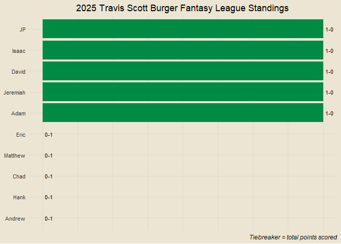<!-- -->

------------------------------------------------------------------------

### Points Scored per Game

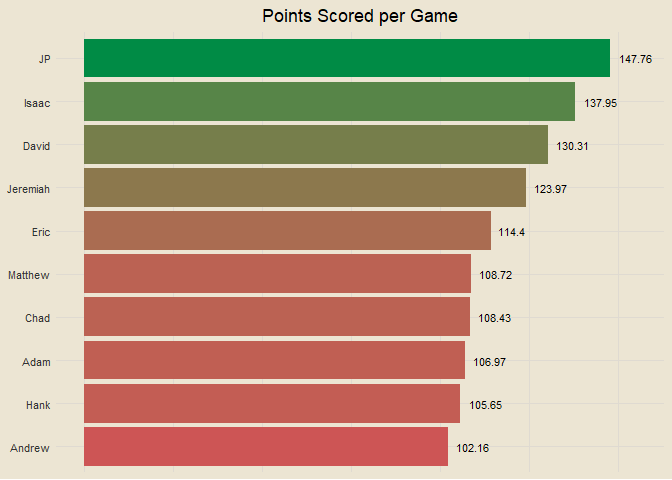<!-- -->

------------------------------------------------------------------------

### Points Against per Game

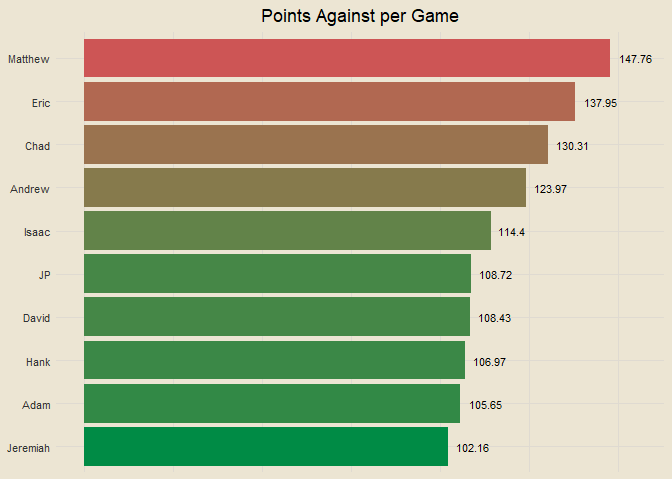<!-- -->

------------------------------------------------------------------------

### Points Scored and Against

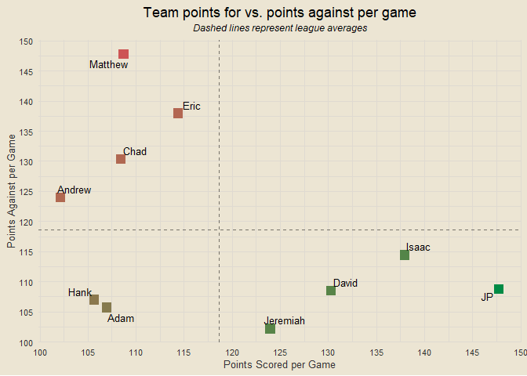<!-- -->

------------------------------------------------------------------------

### Optimal Lineup Setting

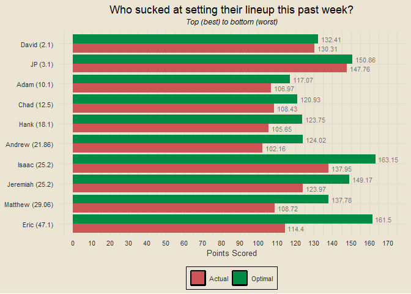<!-- -->

------------------------------------------------------------------------

### Season Long Optimal Lineups

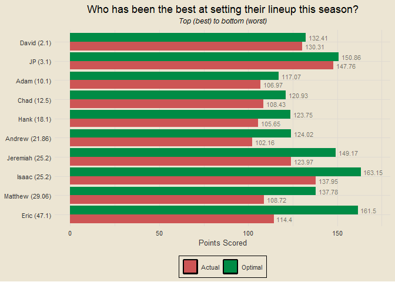<!-- -->

------------------------------------------------------------------------

### Most Points Scored in a Loss

- Week 1: Isaac def. Eric 137.95-114.4
- Week 1: JP def. Matthew 147.76-108.72
- Week 1: David def. Chad 130.31-108.43
- Week 1: Adam def. Hank 106.97-105.65
- Week 1: Jeremiah def. Andrew 123.97-102.16

------------------------------------------------------------------------

### Fewest Points Scored in a Victory

- Week 1: Adam def. Hank 106.97-105.65
- Week 1: Jeremiah def. Andrew 123.97-102.16
- Week 1: David def. Chad 130.31-108.43
- Week 1: Isaac def. Eric 137.95-114.4
- Week 1: JP def. Matthew 147.76-108.72

------------------------------------------------------------------------

### Weekly Scoring Trends

<!-- Coming next week -->

    ## `geom_line()`: Each group consists of only one observation.
    ## ℹ Do you need to adjust the group aesthetic?
    ## `geom_line()`: Each group consists of only one observation.
    ## ℹ Do you need to adjust the group aesthetic?
    ## `geom_line()`: Each group consists of only one observation.
    ## ℹ Do you need to adjust the group aesthetic?
    ## `geom_line()`: Each group consists of only one observation.
    ## ℹ Do you need to adjust the group aesthetic?
    ## `geom_line()`: Each group consists of only one observation.
    ## ℹ Do you need to adjust the group aesthetic?
    ## `geom_line()`: Each group consists of only one observation.
    ## ℹ Do you need to adjust the group aesthetic?
    ## `geom_line()`: Each group consists of only one observation.
    ## ℹ Do you need to adjust the group aesthetic?
    ## `geom_line()`: Each group consists of only one observation.
    ## ℹ Do you need to adjust the group aesthetic?
    ## `geom_line()`: Each group consists of only one observation.
    ## ℹ Do you need to adjust the group aesthetic?
    ## `geom_line()`: Each group consists of only one observation.
    ## ℹ Do you need to adjust the group aesthetic?

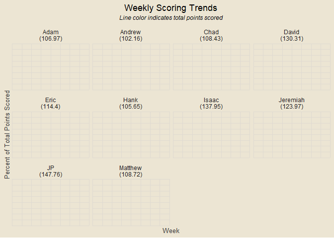<!-- -->

------------------------------------------------------------------------

### Close Games

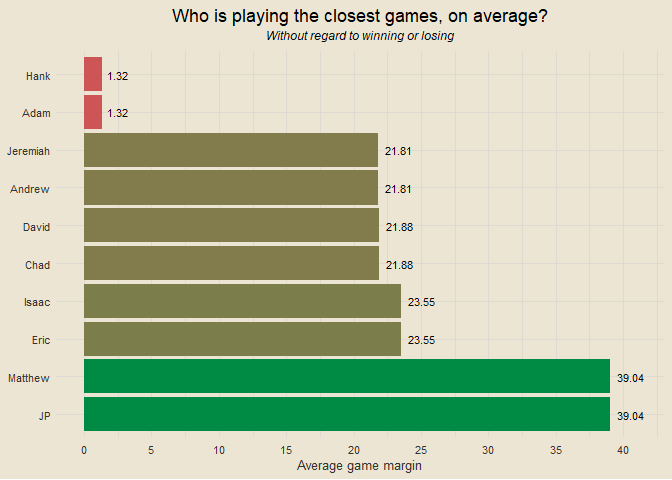<!-- -->

------------------------------------------------------------------------

### Highest Scoring Games

- Week 1: JP def. Matthew 147.76-108.72
- Week 1: Isaac def. Eric 137.95-114.4
- Week 1: David def. Chad 130.31-108.43
- Week 1: Jeremiah def. Andrew 123.97-102.16
- Week 1: Adam def. Hank 106.97-105.65

------------------------------------------------------------------------

### Biggest Blowouts

- Week 1: JP def. Matthew 147.76-108.72
- Week 1: Isaac def. Eric 137.95-114.4
- Week 1: David def. Chad 130.31-108.43
- Week 1: Jeremiah def. Andrew 123.97-102.16
- Week 1: Adam def. Hank 106.97-105.65

------------------------------------------------------------------------

### Closest Games

- Week 1: Adam def. Hank 106.97-105.65
- Week 1: Jeremiah def. Andrew 123.97-102.16
- Week 1: David def. Chad 130.31-108.43
- Week 1: Isaac def. Eric 137.95-114.4
- Week 1: JP def. Matthew 147.76-108.72

------------------------------------------------------------------------

### Most Points Scored by One Team

- 147.76 (JP, Week 1)
- 137.95 (Isaac, Week 1)
- 130.31 (David, Week 1)
- 123.97 (Jeremiah, Week 1)
- 114.4 (Eric, Week 1)

------------------------------------------------------------------------

### Fewest Points Scored by One Team

- 102.16 (Andrew, Week 1)
- 105.65 (Hank, Week 1)
- 106.97 (Adam, Week 1)
- 108.43 (Chad, Week 1)
- 108.72 (Matthew, Week 1)

------------------------------------------------------------------------

### Past Week One Player Merchants

- D’Andre Swift: 31.2% of total points for Andrew
- Caleb Williams: 30.2% of total points for Eric
- Jahmyr Gibbs: 29.1% of total points for Adam
- Josh Allen: 26.1% of total points for Jeremiah
- Derrick Henry: 25.2% of total points for Isaac

------------------------------------------------------------------------

### Full Season One Player Merchants

- D’Andre Swift: 31.23% of total points for Andrew
- Caleb Williams: 30.22% of total points for Eric
- Jahmyr Gibbs: 29.07% of total points for Adam
- Josh Allen: 26.07% of total points for Jeremiah
- Derrick Henry: 25.23% of total points for Isaac

------------------------------------------------------------------------

<!-- ### Luckiest Teams This Past Week -->

<!-- ___ -->

<!-- ### Luckiest Teams Season Long -->

<!-- ___ -->

<!-- ### Self Luck and Opponent Luck -->

<!-- ___ -->

### Average Weekly Finishing Position

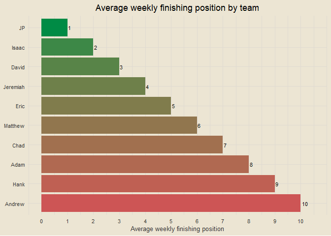<!-- -->

For example: if Hank had the best score in the league, the third best
score in the league, and the second best score in the league through
three weeks, his average weekly finishing position would be (1 + 3 + 2)
/ 3 = 2. Closely related to points per game, but not the exact same.

------------------------------------------------------------------------

### Chug Analysis

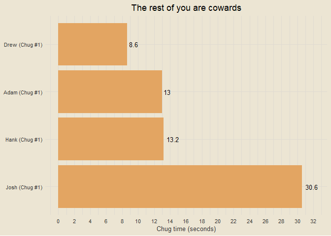<!-- -->

------------------------------------------------------------------------

### Win Percentage by Strength of Schedule

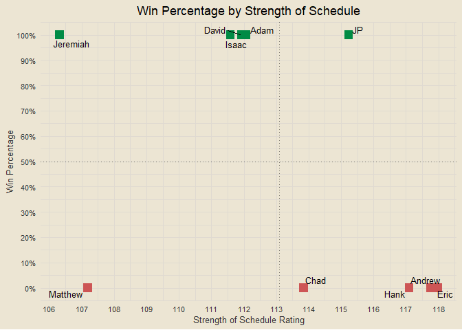<!-- -->

Strength of schedule is calculated as the average projected score of
your opponents. So if JP were to play three opponents with projected
scores of 100, 110, and 120, his SOS rating would be (100 + 110 + 120) /
3 = 110.

------------------------------------------------------------------------

### League Wide Optimal Scoring

<!-- Coming next week -->

    ## `geom_line()`: Each group consists of only one observation.
    ## ℹ Do you need to adjust the group aesthetic?

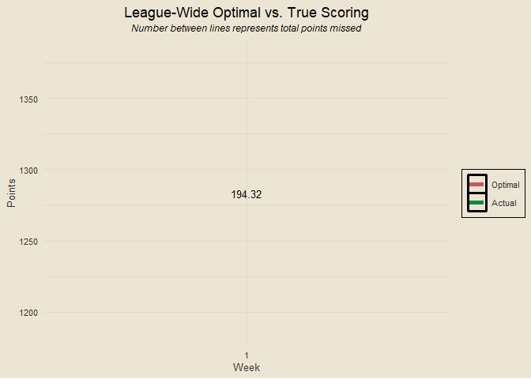<!-- -->

------------------------------------------------------------------------

### Top Three Scoring

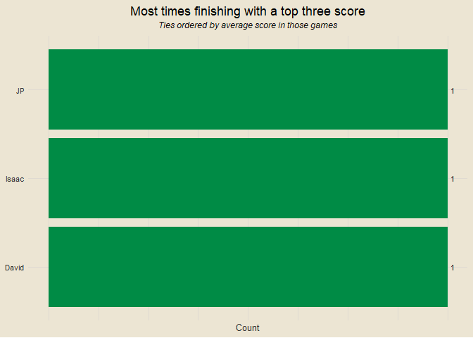<!-- -->

------------------------------------------------------------------------

### Bottom Three Scoring

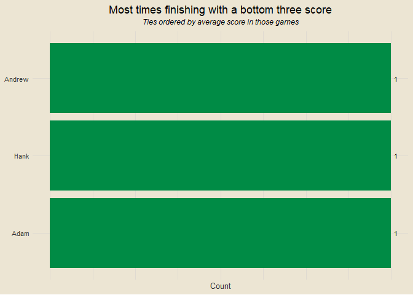<!-- -->

------------------------------------------------------------------------

<!-- ### Average Scoring in Wins -->

<!-- ___ -->

<!-- ### Projected Records -->

<!-- ___ -->

### Wins When Projected to Lose

- JP: 1 win when projected to lose
- Adam: 0 wins when projected to lose
- Andrew: 0 wins when projected to lose
- Chad: 0 wins when projected to lose
- David: 0 wins when projected to lose
- Eric: 0 wins when projected to lose
- Hank: 0 wins when projected to lose
- Isaac: 0 wins when projected to lose
- Jeremiah: 0 wins when projected to lose
- Matthew: 0 wins when projected to lose

------------------------------------------------------------------------

### Team Records vs League Median

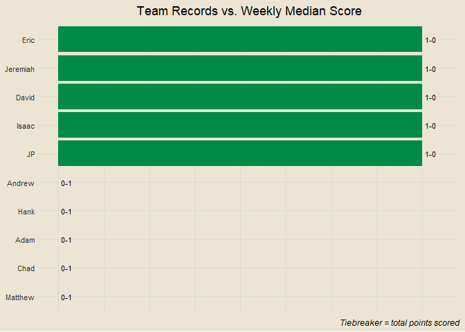<!-- -->

------------------------------------------------------------------------

### Supreme Luck Merchant

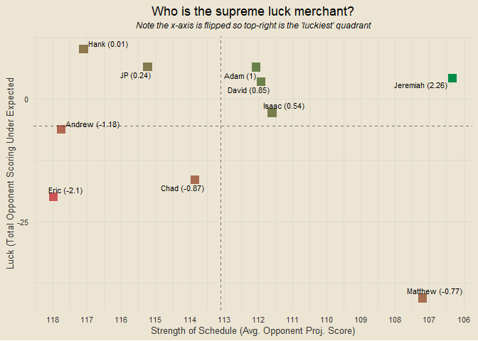<!-- -->

**Label numbers explained**: To calculate these overall values, I
normalized both everyone’s strength of schedule ratings and their luck
ratings so that they are on the same scale. Note that my calculation
assumes these two are equal, i.e. strength of schedule and opponent
scoring under average play an equal role in determining someone’s “luck”
as we’re loosely defining it. Once I have these two normalized numbers,
I subtract the normalized SOS score from the normalized luck score
because a lower SOS is “luckier” so to speak. This then determines the
overall number you see in parentheses next to everyone’s names.

------------------------------------------------------------------------

### Parlay Tracking

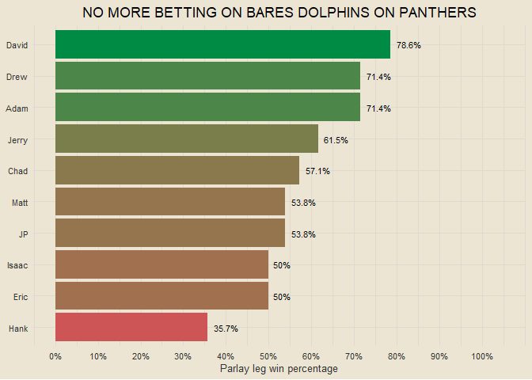<!-- -->

------------------------------------------------------------------------

### Opponent Adjusted PPG

Description under the plot after this one

    ## Warning: Removed 10 rows containing missing values or values outside the scale range
    ## (`geom_col()`).

    ## Warning: Removed 10 rows containing missing values or values outside the scale range
    ## (`geom_text()`).

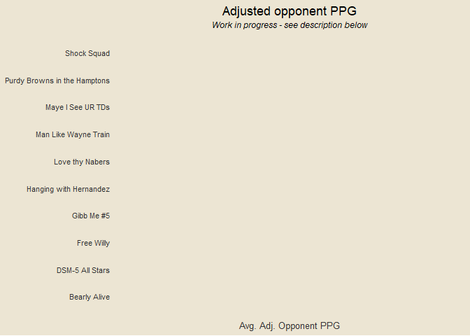<!-- -->

------------------------------------------------------------------------

### Opponent Scoring Compared to Adjusted PPG

    ## Warning: Position guide is perpendicular to the intended axis.
    ## ℹ Did you mean to specify a different guide `position`?

    ## Warning: Removed 10 rows containing missing values or values outside the scale range
    ## (`geom_point()`).

    ## Warning: Removed 10 rows containing missing values or values outside the scale range
    ## (`geom_text_repel()`).

    ## Warning: Removed 1 row containing missing values or values outside the scale range
    ## (`geom_vline()`).

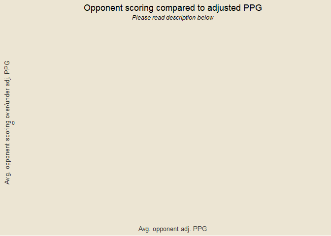<!-- -->

This one is a work in progress and another pseudo-attempt at
visualizing/quantifying strength of schedule. The motivation behind it
is to get average opponent PPG in games where they are not playing you.
For example, suppose I am playing Hank. His “adjusted PPG” would be his
PPG in games he has played against everyone else but me. So if Hank
scored 100 against me, 110 against David, 120 against JP, 80 against
Adam, and 95 against Josh, his “adjusted PPG” would be (110 + 120 + 80 +
95) / 4 = 101.25. If you wanted to, you could go a step further with
this and say that given that number, Hank scoring 100 against me would
be him under performing by 1.25 points compared to his “adjusted PPG” of
101.25. That is how the y-axis is calculated. *If you made it this far
and are reading this, I love you.* I haven’t yet messed with flipping
axes, so for now, further right would indicate tougher competition, on
average, and higher would indicate your opponent scoring higher than
“expected” given their adjusted PPG.

------------------------------------------------------------------------

### Team Scoring Ranges

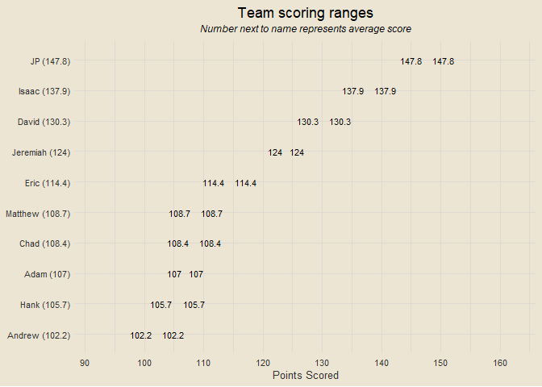<!-- -->

------------------------------------------------------------------------

### Team Points Against Ranges

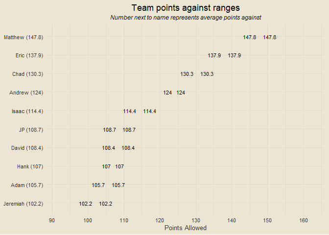<!-- -->

------------------------------------------------------------------------

### Team Point Differentials

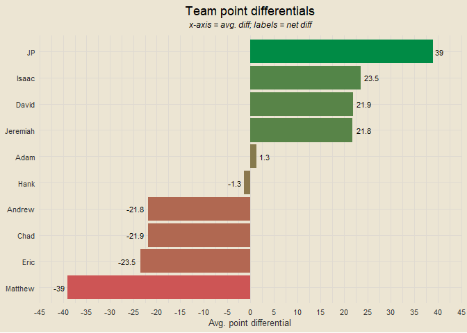<!-- -->

------------------------------------------------------------------------

### Points Scored and Point Differentials

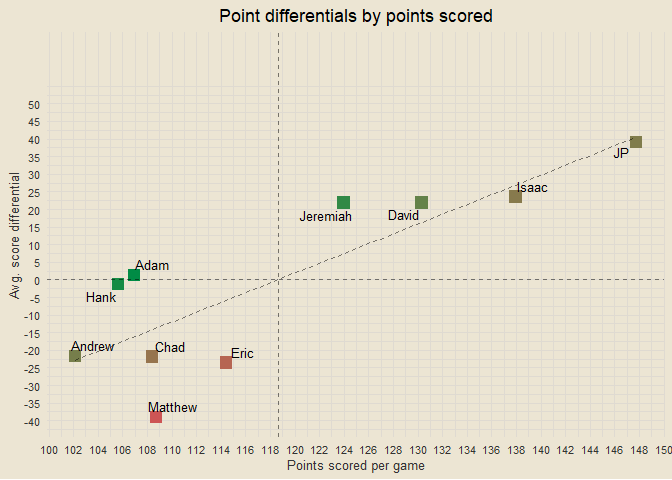<!-- -->

------------------------------------------------------------------------

### Points Scored by Position

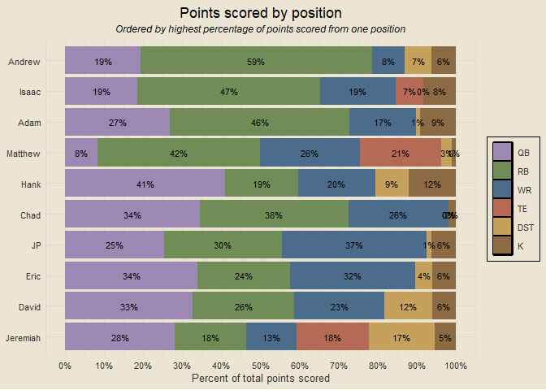<!-- -->

------------------------------------------------------------------------

### Cumulative Score Differentials

    ## `geom_line()`: Each group consists of only one observation.
    ## ℹ Do you need to adjust the group aesthetic?

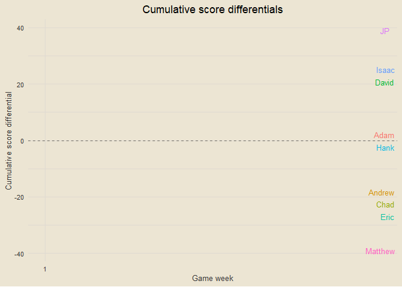<!-- -->

------------------------------------------------------------------------

<!-- ### Percent of Points Scored by Week -->

<!-- ___ -->

### Top Point Scorers

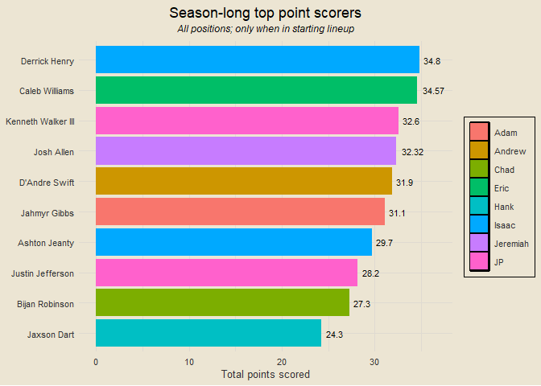<!-- -->

------------------------------------------------------------------------

### Top Point Scorers Among QBs

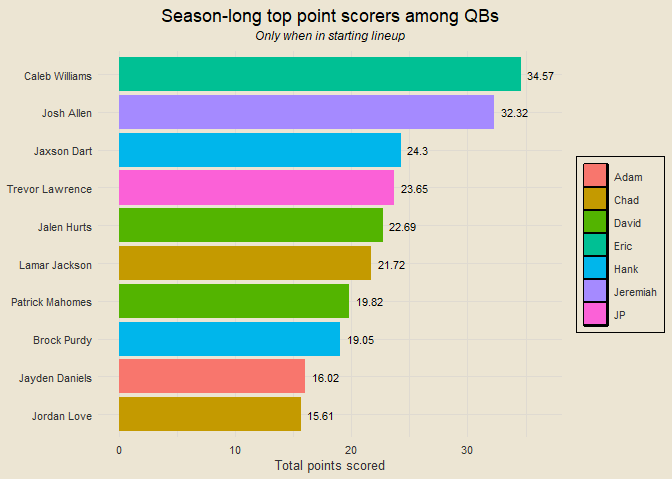<!-- -->

------------------------------------------------------------------------

### Top Point Scorers Among RBs

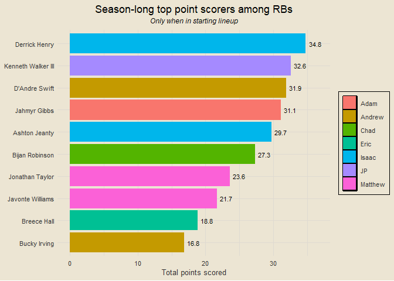<!-- -->

------------------------------------------------------------------------

### Top Point Scorers Among WRs

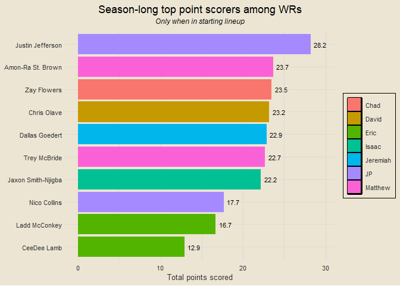<!-- -->

------------------------------------------------------------------------

### Team Scoring Over Projected

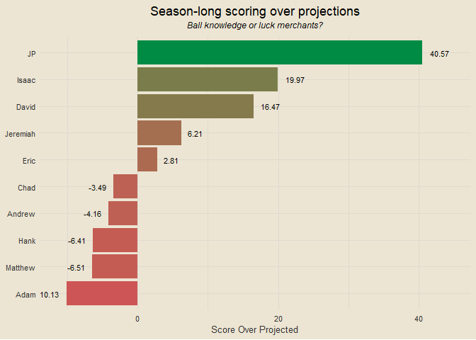<!-- -->

------------------------------------------------------------------------

### Player Scoring Over Projected

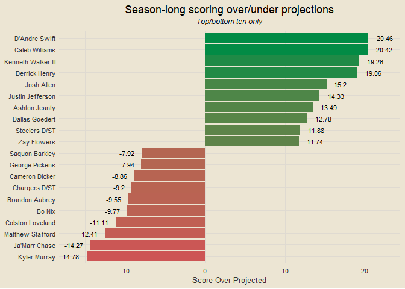<!-- -->

------------------------------------------------------------------------
